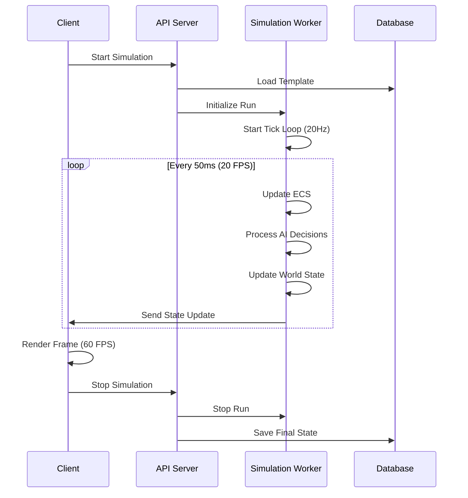

# Architecture Overview

This guide provides a comprehensive overview of Agentik's system architecture, including component design, data flow, and performance considerations.

## System Architecture

Agentik follows a modern client-server architecture with clear separation of concerns between simulation logic, presentation, and data persistence.

```mermaid
graph TB
    subgraph "Client Layer"
        UI[Web UI]
        Canvas[Phaser Canvas]
        Controls[Simulation Controls]
    end
    
    subgraph "API Layer"
        Express[Express Server]
        Routes[API Routes]
        Middleware[Security Middleware]
    end
    
    subgraph "Business Logic"
        ECS[ECS Engine]
        AI[AI Systems]
        World[World Management]
    end
    
    subgraph "Data Layer"
        DB[(Database)]
        Cache[In-Memory Cache]
        Files[File Storage]
    end
    
    subgraph "External Services"
        AI_Providers[AI Providers]
        TinyTown[TinyTown Integration]
    end
    
    UI --> Express
    Canvas --> Express
    Controls --> Express
    
    Express --> Routes
    Routes --> Business Logic
    
    Business Logic --> Data Layer
    Business Logic --> External Services
    
    Data Layer --> DB
    Data Layer --> Cache
    Data Layer --> Files
```

## Component Architecture

### 1. Client Layer (Frontend)

The frontend is built with modern web technologies for optimal performance and user experience.

#### Phaser 3 Integration

```typescript
// Main game scene structure
class WorldScene extends Phaser.Scene {
    private ecs: ECS;
    private world: WorldManager;
    private ai: AISystem;
    
    create() {
        // Initialize ECS system
        this.ecs = new ECS();
        
        // Set up world and AI
        this.world = new WorldManager(this);
        this.ai = new AISystem(this.ecs);
        
        // Start simulation loop
        this.startSimulation();
    }
    
    private startSimulation() {
        // 60 FPS render loop
        this.time.addEvent({
            delay: 16, // ~60 FPS
            callback: this.update,
            loop: true
        });
    }
}
```

#### Responsive Design

- **Mobile-First**: Touch controls with pinch-to-zoom
- **Adaptive Layout**: Responsive grid system
- **Performance**: Canvas optimization for mobile devices

### 2. API Layer (Backend)

The Express.js backend provides a RESTful API with comprehensive security and validation.

#### Route Structure

```javascript
// Modular routing with middleware
app.use('/api/sims', simsRouter);
app.use('/api/runs', runsRouter);
app.use('/api/models', modelsRouter);
app.use('/api/maps', mapsRouter);

// Security middleware
app.use(helmet());
app.use(cors(corsOptions));
app.use(rateLimit());
```

#### Security Features

- **CORS**: Configurable cross-origin policies
- **CSP**: Content Security Policy headers
- **Rate Limiting**: Protection against abuse
- **Input Validation**: Comprehensive request validation
- **Encryption**: AES-GCM for sensitive data

### 3. Business Logic Layer

The core simulation logic is built around an Entity-Component-System (ECS) architecture.

#### ECS Architecture

```typescript
// Core ECS implementation
class ECS {
    private entities: Map<string, Entity> = new Map();
    private systems: System[] = [];
    
    addEntity(entity: Entity): void {
        this.entities.set(entity.id, entity);
    }
    
    addSystem(system: System): void {
        this.systems.push(system);
    }
    
    update(deltaTime: number): void {
        // Update all systems
        for (const system of this.systems) {
            system.update(this.entities, deltaTime);
        }
    }
}
```

#### System Components

- **NeedSystem**: Manages agent needs and motivations
- **DecisionSystem**: Handles AI decision-making
- **MovementSystem**: Controls agent movement and pathfinding
- **InteractionSystem**: Manages agent interactions
- **RenderSystem**: Handles visual representation

### 4. Data Layer

Flexible data persistence with multiple storage backends and intelligent fallbacks.

#### Storage Strategy

```javascript
// Database adapter with fallback
class DatabaseAdapter {
    constructor() {
        this.useSupabase = !!(process.env.SUPABASE_URL && process.env.SUPABASE_SERVICE_ROLE);
        this.useNeon = !!process.env.DATABASE_URL;
        this.useInMemory = !this.useSupabase && !this.useNeon;
    }
    
    async query(sql, params) {
        if (this.useSupabase) {
            return await this.supabaseQuery(sql, params);
        } else if (this.useNeon) {
            return await this.neonQuery(sql, params);
        } else {
            return await this.inMemoryQuery(sql, params);
        }
    }
}
```

#### Data Models

- **Simulation Templates**: World configuration and agent definitions
- **Simulation Runs**: Execution state and results
- **Maps and Assets**: Tiled maps and tileset images
- **Provider Credentials**: Encrypted AI service configurations

## Data Flow Architecture

### 1. Simulation Loop

The simulation runs on a separate tick from the render loop for optimal performance.



### 2. Message Passing

Inter-process communication uses structured messages for type safety and performance.

```typescript
// Message types for worker communication
interface SimulationMessage {
    type: 'start' | 'stop' | 'update' | 'state';
    payload: any;
    timestamp: number;
}

interface StateUpdate {
    agents: AgentState[];
    world: WorldState;
    time: number;
    statistics: SimulationStats;
}
```

### 3. Event System

The platform uses a comprehensive event system for loose coupling between components.

```typescript
// Event bus for system communication
class EventBus {
    private listeners: Map<string, Function[]> = new Map();
    
    emit(event: string, data: any): void {
        const handlers = this.listeners.get(event) || [];
        handlers.forEach(handler => handler(data));
    }
    
    on(event: string, handler: Function): void {
        if (!this.listeners.has(event)) {
            this.listeners.set(event, []);
        }
        this.listeners.get(event)!.push(handler);
    }
}
```

## Performance Architecture

### 1. Frame Budget Management

The system maintains consistent performance through careful frame budget allocation.

```typescript
// Frame budget allocation
class FrameBudget {
    private readonly TICK_TIME = 50; // 20 FPS
    private readonly RENDER_TIME = 16; // 60 FPS
    
    update(deltaTime: number): void {
        // Allocate time for different systems
        const aiTime = deltaTime * 0.3;    // 30% for AI
        const physicsTime = deltaTime * 0.4; // 40% for physics
        const renderTime = deltaTime * 0.3;  // 30% for rendering
        
        // Execute systems within budget
        this.updateAI(aiTime);
        this.updatePhysics(physicsTime);
        this.updateRender(renderTime);
    }
}
```

### 2. Optimization Strategies

- **Object Pooling**: Reuse frequently created objects
- **Spatial Partitioning**: Efficient collision detection
- **LOD System**: Level of detail for distant objects
- **Staggered Updates**: Distribute processing across frames

### 3. Memory Management

```typescript
// Object pool for agents
class AgentPool {
    private pool: Agent[] = [];
    private active: Set<Agent> = new Set();
    
    get(): Agent {
        if (this.pool.length > 0) {
            const agent = this.pool.pop()!;
            this.active.add(agent);
            return agent;
        }
        return new Agent();
    }
    
    release(agent: Agent): void {
        this.active.delete(agent);
        agent.reset();
        this.pool.push(agent);
    }
}
```

## Scalability Architecture

### 1. Horizontal Scaling

The system is designed for horizontal scaling across multiple instances.

```javascript
// Load balancing configuration
const cluster = require('cluster');
const numCPUs = require('os').cpus().length;

if (cluster.isMaster) {
    // Fork workers
    for (let i = 0; i < numCPUs; i++) {
        cluster.fork();
    }
    
    cluster.on('exit', (worker, code, signal) => {
        console.log(`Worker ${worker.process.pid} died`);
        cluster.fork(); // Replace dead worker
    });
} else {
    // Worker process
    require('./server.js');
}
```

### 2. Database Scaling

- **Read Replicas**: Distribute read load
- **Connection Pooling**: Efficient database connections
- **Caching**: Redis for frequently accessed data
- **Sharding**: Horizontal data partitioning

### 3. API Scaling

- **Rate Limiting**: Per-user and global limits
- **Caching**: Response caching with invalidation
- **Compression**: Gzip compression for responses
- **CDN**: Content delivery network integration

## Security Architecture

### 1. Authentication & Authorization

```typescript
// JWT-based authentication
interface AuthContext {
    userId: string;
    permissions: string[];
    sessionId: string;
}

class AuthMiddleware {
    async authenticate(token: string): Promise<AuthContext> {
        try {
            const decoded = jwt.verify(token, process.env.JWT_SECRET);
            return this.validateSession(decoded);
        } catch (error) {
            throw new AuthError('Invalid token');
        }
    }
}
```

### 2. Data Protection

- **Encryption**: AES-GCM for sensitive data
- **Input Sanitization**: Comprehensive validation
- **SQL Injection Protection**: Parameterized queries
- **XSS Prevention**: Content Security Policy

### 3. Network Security

- **HTTPS**: TLS encryption for all communications
- **CORS**: Configurable cross-origin policies
- **Rate Limiting**: Protection against abuse
- **DDoS Protection**: Traffic filtering and monitoring

## Deployment Architecture

### 1. Container Strategy

```dockerfile
# Multi-stage Docker build
FROM node:18-alpine AS builder
WORKDIR /app
COPY package*.json ./
RUN npm ci --only=production

FROM node:18-alpine AS runtime
WORKDIR /app
COPY --from=builder /app/node_modules ./node_modules
COPY . .
EXPOSE 5001
CMD ["node", "server.js"]
```

### 2. Environment Management

- **Configuration**: Environment-specific settings
- **Secrets**: Secure secret management
- **Monitoring**: Health checks and metrics
- **Logging**: Structured logging with levels

### 3. CI/CD Pipeline

```yaml
# GitHub Actions workflow
name: Deploy
on:
  push:
    branches: [main]
jobs:
  deploy:
    runs-on: ubuntu-latest
    steps:
      - uses: actions/checkout@v4
      - uses: actions/setup-node@v4
      - run: npm ci
      - run: npm run build
      - run: npm run test
      - name: Deploy to Production
        run: npm run deploy
```

## Monitoring & Observability

### 1. Metrics Collection

- **Performance**: Response times and throughput
- **Resources**: CPU, memory, and disk usage
- **Business**: User activity and simulation metrics
- **Errors**: Error rates and failure patterns

### 2. Logging Strategy

```typescript
// Structured logging with levels
class Logger {
    info(message: string, context: any = {}): void {
        console.log(JSON.stringify({
            level: 'info',
            message,
            timestamp: new Date().toISOString(),
            ...context
        }));
    }
    
    error(message: string, error: Error, context: any = {}): void {
        console.error(JSON.stringify({
            level: 'error',
            message,
            error: error.message,
            stack: error.stack,
            timestamp: new Date().toISOString(),
            ...context
        }));
    }
}
```

### 3. Health Checks

```typescript
// Health check endpoints
app.get('/health', (req, res) => {
    const health = {
        status: 'healthy',
        timestamp: new Date().toISOString(),
        uptime: process.uptime(),
        memory: process.memoryUsage(),
        database: await checkDatabaseHealth()
    };
    
    res.json(health);
});
```

## Future Architecture Considerations

### 1. Microservices Evolution

- **Service Decomposition**: Break into focused services
- **API Gateway**: Centralized routing and authentication
- **Event Streaming**: Kafka for asynchronous communication
- **Service Mesh**: Istio for service-to-service communication

### 2. Real-time Enhancements

- **WebSocket Scaling**: Redis for WebSocket clustering
- **GraphQL**: Flexible data querying
- **Server-Sent Events**: Real-time updates
- **WebRTC**: Peer-to-peer communication

### 3. AI Integration

- **Model Serving**: Dedicated AI inference services
- **Vector Databases**: Semantic search and similarity
- **Federated Learning**: Distributed AI training
- **Edge AI**: On-device inference capabilities

This architecture provides a solid foundation for building scalable, maintainable artificial life simulations while maintaining flexibility for future enhancements and integrations.
